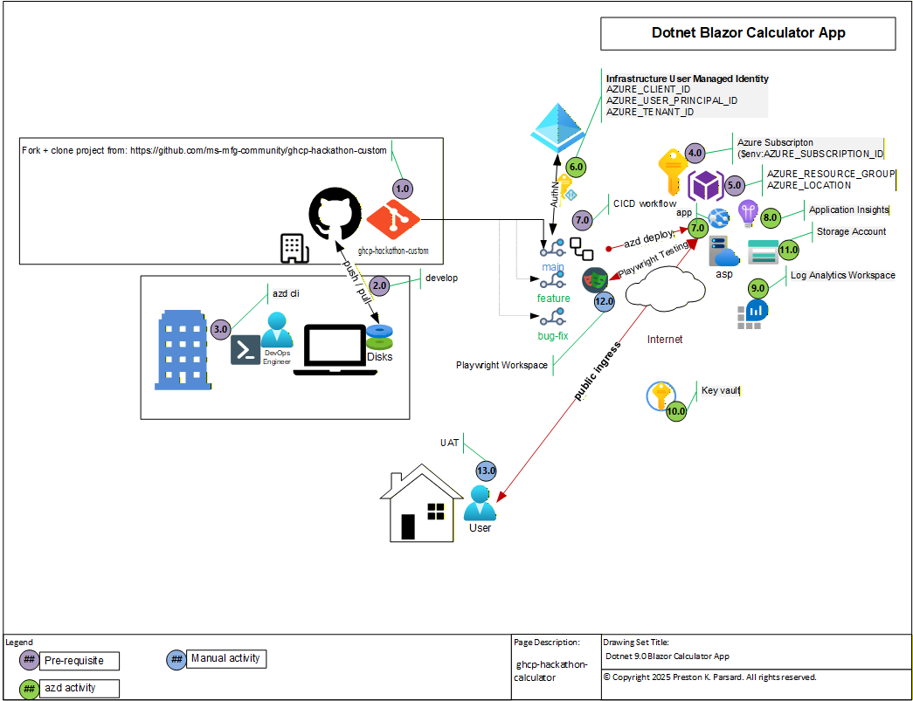

# Product Requirements Document (PRD)
## Blazor Calculator: Migration to Azure with Azure Developer CLI (azd)

**Version:** 1.0  
**Author:** GitHub Copilot  
**Date:** November 3, 2025  
**Status:** Ready for Implementation  
**Tenant ID:** `$env:AZURE_TENANT_ID`  
**Subscription ID:** `$env:AZURE_SUBSCRIPTION_ID`

---

## 1. Executive Summary

This PRD defines the requirements for migrating the Blazor Calculator application from local development to Azure cloud infrastructure using the Azure Developer CLI (`azd`) with Infrastructure as Code (Bicep templates), GitHub Actions for CI/CD orchestration, and a comprehensive observability stack including Application Insights and Log Analytics.

**Key Objectives:**
- Deploy Blazor Server application to Azure App Service
- Implement production-grade infrastructure using Bicep IaC
- Establish automated CI/CD pipeline via GitHub Actions
- Ensure enterprise-level monitoring and logging
- Maintain security best practices with Key Vault integration
- Achieve cost efficiency using Free/Basic tier resources

> **Note:** Tenant and Subscription IDs are stored as environment variables (`$env:AZURE_TENANT_ID` and `$env:AZURE_SUBSCRIPTION_ID`) for security. Set these in your terminal session before running azd commands.

---

## 2. Problem Statement

The Blazor Calculator application is currently running only in local development environments. There is a need to:

1. **Make the application publicly accessible** - Share calculator with stakeholders via public URL
2. **Establish production infrastructure** - Move beyond localhost development
3. **Implement DevOps practices** - Automate builds, tests, and deployments
4. **Achieve observability** - Monitor application performance and health
5. **Ensure security** - Manage secrets and implement security best practices
6. **Enable scalability** - Prepare for future growth and feature additions
7. **Support Playwright E2E testing** - Enable automated UI testing against live Azure environment

---

## 3. Goals and Objectives

### 3.1 Primary Goals

**G1: Successful Azure Deployment**
- Blazor Calculator running on Azure App Service
- Accessible via public HTTPS URL
- All 42 unit tests passing in CI/CD pipeline

**G2: Infrastructure as Code**
- All Azure resources defined in Bicep templates
- Reproducible deployments (dev/test/prod environments)
- Version-controlled infrastructure in Git

**G3: Automated Deployments**
- GitHub Actions pipeline triggering on code changes
- Zero-downtime deployments
- Automatic rollback capability

**G4: Production Readiness**
- Application Insights monitoring active
- Log Analytics aggregating all logs
- Alert rules configured for critical issues

### 3.2 Secondary Goals

**G5: Cost Optimization**
- Free tier resources where possible
- Auto-scaling for efficient resource usage
- Cost tracking and optimization

**G6: Security Hardening**
- Secrets management via Key Vault
- Managed Identity (passwordless authentication)
- HTTPS enforcement with TLS 1.2+

**G7: Team Enablement**
- Comprehensive documentation
- Runbooks for common operations
- Training for deployment procedures

---

## 4. Scope

### 4.1 In Scope

**Infrastructure & Deployment:**
- Azure Resource Group provisioning
- App Service Plan (Free F1 or Basic B1)
- App Service hosting Blazor Server app
- Bicep templates for all infrastructure
- Azure Developer CLI (`azd`) project setup
- GitHub Actions workflow for CI/CD

**Security & Secrets:**
- Azure Key Vault for credential management
- Managed Identity for app authentication
- RBAC configuration for team access

**Monitoring & Logging:**
- Application Insights for telemetry
- Log Analytics Workspace for log aggregation
- Alert rules for critical conditions
- Monitoring dashboards

**Source Control & Automation:**
- GitHub Actions pipeline
- Automated testing on PR
- Automated deployment on merge to main
- Environment management via azd

**Code Integration:**
- appsettings.json for configuration management
- Application Insights SDK integration
- Environment variable injection
- Deployment slot configuration (future)

### 4.2 Out of Scope

**Not Included:**
- Database implementation (planned for Phase 2)
- Azure AD B2C authentication (future phase)
- Azure Front Door / CDN
- Private Endpoints or network isolation
- DDoS Protection
- Azure API Management
- Static Web App deployment
- Container Registry or Docker configuration
- Kubernetes deployment (AKS)
- Multi-region failover
- Infrastructure backup automation (manual process)
- Cost chargeback/showback system

---

## 5. Success Criteria / KPIs

### 5.1 Deployment Success

- ✅ `azd init` completes without errors
- ✅ `azd up` provisions all resources successfully
- ✅ App Service is in "Running" state
- ✅ HTTPS certificate valid and active
- ✅ Public URL accessible: `https://app-calculator-*.azurewebsites.net`
- ✅ All 42 unit tests passing in CI/CD pipeline

### 5.2 Application Functionality

- ✅ Calculator operations work correctly on Azure (5 + 3 = 8)
- ✅ All 6 operators functional (+ - * / % ^)
- ✅ History tracking operational
- ✅ Error handling displays "Cannot divide by zero"
- ✅ Response time < 1 second (P95)
- ✅ Uptime > 99% during testing window

### 5.3 Observability

- ✅ Application Insights receiving telemetry
- ✅ Server requests visible in Application Insights
- ✅ Logs appearing in Log Analytics Workspace
- ✅ Exceptions captured and alerted
- ✅ Custom metrics available (calculator operations)
- ✅ Dashboard displays key performance indicators

### 5.4 Security & Compliance

- ✅ Secrets stored in Key Vault (not in code/config)
- ✅ Managed Identity authentication working
- ✅ HTTPS only enforced
- ✅ TLS 1.2 minimum
- ✅ WebSockets enabled for SignalR
- ✅ RBAC configured for team access

### 5.5 CI/CD & Automation

- ✅ GitHub Actions workflow executing on push
- ✅ Automated build and test on PR
- ✅ Automated deployment on merge to main
- ✅ Deployment notifications sent
- ✅ Rollback capability documented
- ✅ Pipeline logs accessible for troubleshooting

### 5.6 Cost

- ✅ Monthly cost ≤ $30 (Free tier: ~$2-5, Basic B1: ~$13)
- ✅ Resource usage tracked in Cost Analysis
- ✅ No unexpected charges
- ✅ Free tier limits understood and monitored

---

## 6. User Stories

**US1: Developer Deploys Calculator to Azure**
- As a developer, I want to deploy the calculator to Azure with a single command
- So that I can share the application with stakeholders
- Acceptance Criteria:
  - `azd up` completes in < 10 minutes
  - App is immediately accessible via public URL
  - All unit tests pass before deployment

**US2: Team Member Views Application Health**
- As a team member, I want to see application performance metrics
- So that I can monitor the health and identify issues
- Acceptance Criteria:
  - Application Insights dashboard shows response times
  - Error rates visible and alerting configured
  - Historical data available for trend analysis

**US3: QA Executes Playwright Tests on Azure**
- As a QA engineer, I want to run E2E tests against the deployed app
- So that I can validate the application in production environment
- Acceptance Criteria:
  - Stable public URL available for testing
  - All calculator operations testable
  - data-testid attributes work with Playwright

**US4: DevOps Engineer Manages Secrets**
- As a DevOps engineer, I want to store secrets securely in Key Vault
- So that credentials are not exposed in code or configuration
- Acceptance Criteria:
  - Connection strings in Key Vault
  - App Service accesses via Managed Identity
  - No secrets in appsettings files

**US5: Team Responds to Deployment Issues**
- As a team member, I want clear logs and diagnostics
- So that I can troubleshoot deployment problems quickly
- Acceptance Criteria:
  - Log Analytics shows all application logs
  - Deployment errors visible in GitHub Actions
  - Runbooks document common issues

---

## 7. Functional Requirements

| ID | Requirement | Priority | Details |
|----|------------|----------|---------|
| FR-1 | Azure Resources Provision | P0 | Bicep templates provision all required resources via `azd` |
| FR-2 | App Service Hosts Blazor | P0 | Blazor Server app runs on Azure App Service |
| FR-3 | HTTPS/TLS Enforced | P0 | All traffic encrypted with TLS 1.2 minimum |
| FR-4 | SignalR Enabled | P0 | WebSockets enabled for Blazor Server communication |
| FR-5 | Key Vault Integration | P0 | Secrets retrieved from Key Vault via Managed Identity |
| FR-6 | Application Insights Active | P0 | Telemetry collected and visible in dashboard |
| FR-7 | Log Analytics Aggregation | P0 | All logs centralized in Log Analytics Workspace |
| FR-8 | GitHub Actions Pipeline | P0 | Automated build, test, deploy on code changes |
| FR-9 | Configuration Management | P1 | appsettings.json supports environment-specific config |
| FR-10 | Alert Rules Configured | P1 | Critical alerts trigger on errors/downtime |
| FR-11 | Cost Monitoring | P1 | Cost Analysis dashboard tracks monthly spend |
| FR-12 | Deployment Rollback | P2 | Previous versions can be restored if needed |
| FR-13 | Health Check Endpoint | P2 | Health check available for monitoring |
| FR-14 | Custom Metrics | P2 | Calculator operations tracked as custom metrics |

---

## 8. Non-Functional Requirements

### 8.1 Performance

- **Response Time:** P95 < 1 second (for typical operations)
- **Throughput:** Support 100+ concurrent users
- **Availability:** ≥ 99% uptime during testing window
- **Scalability:** Auto-scale to 2-5 instances under load (if needed)

### 8.2 Security

- **Authentication:** Managed Identity (passwordless)
- **Encryption:** TLS 1.2+ in transit, encryption at rest
- **Secrets:** Zero hardcoded secrets, all in Key Vault
- **Logging:** All access and operations logged
- **Compliance:** No PII in logs by default

### 8.3 Reliability

- **MTTR (Mean Time to Recovery):** < 15 minutes via rollback
- **Backup Strategy:** Git repo is primary backup
- **Disaster Recovery:** Infrastructure reproducible via Bicep
- **Error Handling:** Graceful degradation, user-friendly error messages

### 8.4 Maintainability

- **IaC:** 100% infrastructure in Bicep (no manual resource creation)
- **Documentation:** Comprehensive runbooks for operations
- **Code Quality:** All 42 tests passing in CI/CD
- **Standards:** Follow Azure Well-Architected Framework

### 8.5 Usability

- **Deployment:** Single command (`azd up`) for deployment
- **Monitoring:** Intuitive dashboards with key metrics
- **Troubleshooting:** Clear error messages and logs

---

## 9. Technical Architecture

### 9.1 Cloud Architecture



> **Architecture Diagram Reference**
> 
> The visual diagram above illustrates the complete end-to-end architecture showing all components, their relationships, and data flow paths.
>
> The diagram shows:
> - Development workflow (GitHub → azd CLI → CI/CD pipeline)
> - Infrastructure provisioning (Resource Groups, App Service, Key Vault)
> - Observability stack (Application Insights, Log Analytics)
> - User access and Playwright E2E testing integration
> - All numbered component references explained below

#### Architecture Component Reference

The architecture diagram components are numbered with colored circles as follows:

**Development & Source Control Layer:**
- **1.0 - GitHub Repository**: Central source control hosting the Blazor Calculator application code, Bicep infrastructure templates, and GitHub Actions CI/CD workflows. This is the single source of truth for all infrastructure and application code. Located at: https://github.com/ms-mfg-community/ghcp-hackathon-custom

**Development Environment & Tools:**
- **2.0 - Azure DevOps / azd CLI**: Azure Developer CLI orchestrates the entire deployment pipeline, managing environment provisioning and application deployment through a unified command interface.
- **3.0 - Build Environment (DevOps Engineer)**: The GitHub Actions runner environment where code is compiled, tested (42 unit tests), and packaged for deployment. Includes build artifacts and deployment packages.
- **3.0 - Developer Workstation (Disks)**: Local development machines with source code, Bicep templates, and application configuration files.

**Azure Infrastructure & Subscription Management:**
- **4.0 - Azure Subscription Context**: The target Azure subscription (`$env:AZURE_SUBSCRIPTION_ID`) where all infrastructure resources are provisioned and managed.
- **5.0 - Azure Resource Group**: Logical container organizing all related Azure resources for the Blazor Calculator application in production environment.
- **5.0 - Azure Location**: Geographical region selection for resource deployment (e.g., eastus, westus2).

**Hosting & Compute:**
- **6.0 - App Service Plan (Basic B1)**: The hosting plan providing dedicated compute resources (1 core, 1.75GB RAM, $13/month) suitable for production workloads. Provides the runtime environment for Blazor Server.
- **7.0 - App Service (Blazor Server)**: The main application host running .NET 9.0 runtime with Blazor Server components. Features include:
  - Managed Identity for secure Azure service authentication
  - HTTPS-only enforcement with TLS 1.2+
  - WebSockets enabled for SignalR real-time communication
  - Application Insights SDK for telemetry collection

**Observability & Monitoring:**
- **8.0 - Application Insights**: Observability platform capturing:
  - Request/response telemetry and performance metrics
  - Dependency tracking (database calls, external APIs)
  - Exception logging and detailed stack traces
  - Custom metrics (calculator operations, performance counters)
  - Performance monitoring, alerting, and dashboards
  - Live metrics stream for real-time diagnostics

- **9.0 - Storage Account**: Optional storage for:
  - Deployment artifacts and build outputs
  - Application logs backup and archival
  - Blob storage for future database backups
  - Static content delivery

- **10.0 - Log Analytics Workspace**: Centralized log aggregation service with:
  - 30-day retention policy for historical analysis
  - KQL (Kusto Query Language) for advanced analytics
  - Alert rule engine for critical conditions
  - Interactive dashboards and workbooks
  - Integration with Application Insights data

**Identity, Access & Security:**
- **5.0 - Infrastructure User Managed Identity**: Azure Managed Identity for the App Service enabling:
  - AZURE_CLIENT_ID: Service principal client identifier
  - AZURE_USER_PRINCIPAL_ID: User object identifier
  - AZURE_TENANT_ID: Tenant context for authentication
  - Passwordless authentication to Azure services

- **10.0 - Key Vault**: Secure credential storage and management:
  - Connection strings stored encrypted at rest
  - API keys and secrets management
  - Soft-delete enabled (7-day recovery window)
  - Managed Identity integration for passwordless access
  - Audit logging of all access attempts
  - Role-based access control (RBAC) configuration

**CI/CD & Deployment Pipeline:**
- **6.0 - CI/CD Workflow & app**: GitHub Actions workflow orchestration:
  - Feature branch workflows for development
  - Bug fix workflows for issue resolution
  - Release workflows for version management
  - Automated deployment to Azure infrastructure (azd deploy)
  - Build artifacts production package

**Testing & Quality Assurance:**
- **12.0 - Playwright Workspace**: Automated UI testing framework integrated with CI/CD for:
  - Validating calculator operations (add, subtract, multiply, divide, modulo, power)
  - Testing history functionality and replay
  - Error handling verification (divide by zero, invalid input)
  - Cross-browser compatibility testing
  - Pre-deployment smoke tests
  - E2E validation against production environment

**User Access & Internet:**
- **13.0 - Public Internet / End Users**: End users and QA engineers accessing the application through:
  - Public HTTPS endpoint (`https://app-calculator-*.azurewebsites.net`)
  - Browser-based Blazor Server interactive interface
  - UAT (User Acceptance Testing) environment
  - Playwright-based automated E2E tests
  - Production monitoring and support access

#### Data Flow & Integration

The architecture implements a comprehensive DevOps pipeline with the following data flow:

1. **Development Phase**: Developer commits code to GitHub repository main branch
2. **Trigger Phase**: GitHub Actions workflow automatically triggered on push event
3. **Build Phase**: Code compiled, unit tests executed (42 tests), artifacts published
4. **Infrastructure Phase**: `azd provision` deploys Bicep templates creating/updating all Azure resources
5. **Deployment Phase**: Application code deployed to App Service instance
6. **Telemetry Phase**: Running application sends telemetry to Application Insights in real-time
7. **Logging Phase**: Application logs aggregated and stored in Log Analytics Workspace
8. **Alerting Phase**: Critical conditions automatically trigger alerts via configured channels
9. **User Access Phase**: Users access calculator via public HTTPS endpoint with full functionality
10. **E2E Testing Phase**: Playwright tests validate functionality and performance in production
11. **Monitoring Phase**: Dashboards and workbooks provide visibility into application health
12. **Feedback Phase**: Metrics and logs inform next iteration of development

### 9.2 Text-Based Architecture Overview

```
┌─────────────────────────────────────────────────────────────┐
│                     GitHub Repository                       │
│                  (Source Control & CI/CD)                   │
└────────────────────┬────────────────────────────────────────┘
                     │
                     ↓ (GitHub Actions)
┌─────────────────────────────────────────────────────────────┐
│                    Build & Test Pipeline                    │
│         (Unit Tests, Code Analysis, Artifact Build)         │
└────────────────────┬────────────────────────────────────────┘
                     │
                     ↓ (azd deploy)
┌─────────────────────────────────────────────────────────────┐
│                   Azure Subscription                        │
│              ($env:AZURE_SUBSCRIPTION_ID)                   │
│  ┌────────────────────────────────────────────────────────┐ │
│  │           Resource Group (production)                  │ │
│  │  ┌──────────────────────────────────────────────────┐  │ │
│  │  │ App Service Plan (Basic B1)                      │  │ │
│  │  │ ┌──────────────────────────────────────────────┐ │  │ │
│  │  │ │ App Service (Blazor Server)                  │ │  │ │
│  │  │ │ - .NET 9.0 Runtime                           │ │  │ │
│  │  │ │ - Managed Identity enabled                   │ │  │ │
│  │  │ │ - HTTPS only                                 │ │  │ │
│  │  │ │ - WebSockets enabled (SignalR)               │ │  │ │
│  │  │ │ - Application Insights integrated            │ │  │ │
│  │  │ └──────────────────────────────────────────────┘ │  │ │
│  │  │ ┌──────────────────────────────────────────────┐ │  │ │
│  │  │ │ Key Vault                                    │ │  │ │
│  │  │ │ - Connection strings                         │ │  │ │
│  │  │ │ - API keys & secrets                         │ │  │ │
│  │  │ │ - Soft-delete enabled (7 days)               │ │  │ │
│  │  │ └──────────────────────────────────────────────┘ │  │ │
│  │  │ ┌──────────────────────────────────────────────┐ │  │ │
│  │  │ │ Application Insights                         │ │  │ │
│  │  │ │ - Request telemetry                          │ │  │ │
│  │  │ │ - Dependency tracking                        │ │  │ │
│  │  │ │ - Exception logging                          │ │  │ │
│  │  │ │ - Custom metrics                             │ │  │ │
│  │  │ └──────────────────────────────────────────────┘ │  │ │
│  │  │ ┌──────────────────────────────────────────────┐ │  │ │
│  │  │ │ Log Analytics Workspace                      │ │  │ │
│  │  │ │ - Centralized logging (30-day retention)     │ │  │ │
│  │  │ │ - KQL queries for analysis                   │ │  │ │
│  │  │ │ - Alert rules & dashboards                   │ │  │ │
│  │  │ └──────────────────────────────────────────────┘ │  │ │
│  │  └──────────────────────────────────────────────────┘  │ │
│  └────────────────────────────────────────────────────────┘ │
└─────────────────────────────────────────────────────────────┘
                     │
                     ↓ (HTTPS)
┌─────────────────────────────────────────────────────────────┐
│                     Public Internet                         │
│              Users & QA (Playwright Tests)                  │
└─────────────────────────────────────────────────────────────┘
```

### 9.3 Deployment Architecture

```
Local Development
├── source code (Git)
├── appsettings.json
└── Bicep templates (infra/)

        │
        ↓ (git push to GitHub)

GitHub Repository
├── Source code
├── Bicep templates
├── GitHub Actions workflows
└── azure.yaml

        │
        ↓ (on push to main)

GitHub Actions Pipeline
├── Build job
│   ├── dotnet restore
│   ├── dotnet build
│   └── dotnet test (42 tests)
├── Publish job
│   └── dotnet publish (Release)
├── Infrastructure job
│   ├── Azure login
│   ├── azd provision (Bicep deployment)
│   └── Outputs: resource names, endpoints
└── Deployment job
    ├── Deploy to App Service
    └── Warm up application

        │
        ↓ (automated deployment)

Azure Resources
└── App Service running Blazor Calculator
    ├── Connected to Key Vault
    ├── Sending telemetry to App Insights
    ├── Logging to Log Analytics
    └── Public URL: https://app-calculator-*.azurewebsites.net
```

---

## 10. Free Tier vs. Basic Tier Analysis

### 10.1 Free Tier (F1) - Recommended for Demo/Development

**Specifications:**
- **Cost:** $0/month (included in free Azure credits)
- **vCPU:** 0.6 GHz, shared
- **RAM:** 1 GB
- **Storage:** 1 GB
- **Daily Limit:** 60 CPU minutes/day
- **Auto-Scale:** Not available
- **SLA:** 99.95% availability
- **Custom Domain:** Requires App Service Certificate ($5/month minimum)

**Advantages:**
- ✅ Zero cost (perfect for hackathon/demo)
- ✅ Suitable for low-traffic applications
- ✅ Ideal for Playwright E2E testing
- ✅ Test Azure deployment without cost
- ✅ Good for training and learning

**Gotchas & Limitations:**

1. **Daily CPU Minutes Limit**
   - 60 minutes of CPU time per day
   - Once limit reached, app becomes unavailable until next day
   - Problem: Heavy usage/load testing will trigger limit
   - Solution: Monitor CPU usage; upgrade for production

2. **No Deployment Slots**
   - Cannot use staging/production slots
   - Problem: Higher risk of production issues during deployment
   - Workaround: Manual testing, GitHub Actions safety checks

3. **Shared Infrastructure**
   - Runs on shared hardware with other apps
   - Problem: Performance can vary
   - Acceptable for: Demos, low-traffic scenarios

4. **No Auto-Scaling**
   - Cannot handle traffic spikes
   - Problem: Single concurrent user limit reached quickly
   - Acceptable for: < 5 concurrent users

5. **Always Off Capability**
   - App goes into sleep mode when idle
   - First request takes 30-60 seconds (cold start)
   - Problem: Slow initial load time
   - Solution: Use warmup calls or upgrade

6. **Custom Domain Limitations**
   - Cannot use free *.azurewebsites.net domain with most features
   - Custom domain requires App Service Certificate

7. **No SQL Database Free Tier Pairing**
   - When you add database later, Free tier doesn't pair well
   - Will need to upgrade to at least Basic B1

**When to Use Free Tier:**
- ✅ Proof of concept / demo
- ✅ Testing deployment pipeline
- ✅ Playwright E2E testing
- ✅ Training and learning
- ✅ Pre-production validation

**When NOT to Use Free Tier:**
- ❌ Production application
- ❌ Business-critical workload
- ❌ High traffic application
- ❌ Need guaranteed SLA
- ❌ Planning to add database

---

### 10.2 Basic Tier (B1) - Recommended for Production

**Specifications:**
- **Cost:** ~$13/month
- **vCPU:** 1 core, dedicated
- **RAM:** 1.75 GB
- **Storage:** 10 GB
- **Daily Limit:** None
- **Auto-Scale:** Available (need Standard tier for auto-scale)
- **SLA:** 99.95% availability
- **Custom Domain:** Free with App Service Certificate

**Advantages:**
- ✅ Dedicated resources (predictable performance)
- ✅ No daily CPU limits
- ✅ Deployment slots available
- ✅ Better support
- ✅ Suitable for small production apps
- ✅ Good value for money

**Gotchas:**
- ⚠️ $13/month cost (requires paid subscription or credits)
- ⚠️ No auto-scaling (stays at 1 instance)
- ⚠️ Cannot handle massive traffic spikes

**When to Use Basic B1:**
- ✅ Small production applications
- ✅ Business-critical workloads
- ✅ Need guaranteed performance
- ✅ Planning to add features/database
- ✅ Team applications

---

### 10.3 Recommendation

**For This Project:**

| Phase | Tier | Rationale |
|-------|------|-----------|
| **Demo/Hackathon** | Free F1 | Zero cost, demonstrate capabilities |
| **Playwright Testing** | Free F1 | Sufficient for E2E testing |
| **Production Phase** | Basic B1 | Minimal cost, guaranteed performance |
| **High Traffic** | Standard S1 | Auto-scale, better performance |

**Suggested Implementation:**
```
Start with Free F1 → Test everything → 
If satisfied and low-traffic → Keep Free F1 →
If production use-case → Upgrade to Basic B1 →
If high traffic → Upgrade to Standard S1
```

**Cost Escalation Path:**
```
Free F1:      $0    (60 CPU min/day limit)
Basic B1:     $13   (no limits, dedicated)
Standard S1:  $70   (auto-scale capability)
Standard S2:  $140  (more powerful)
Premium P1:   $465+ (enterprise SLA)
```

---

## 11. Implementation Phases

### Phase 1: Foundation Setup (Days 1-2)

**Deliverables:**
- [ ] Azure Developer CLI installed
- [ ] GitHub repository ready
- [ ] Tenant/Subscription configured
- [ ] Service principal for CI/CD created

**Activities:**
1. Install azd, Azure CLI, .NET 9.0 SDKs
2. Authenticate to Azure tenant
3. Create service principal for GitHub Actions
4. Add secrets to GitHub repository

**Duration:** 2-3 hours

---

### Phase 2: Infrastructure as Code (Days 2-3)

**Deliverables:**
- [ ] azure.yaml created and configured
- [ ] Bicep templates developed (main.bicep + modules)
- [ ] Abbreviations.json for naming conventions
- [ ] Infrastructure documented

**Activities:**
1. Create azure.yaml configuration
2. Develop Bicep templates:
   - Main orchestration (main.bicep)
   - App Service Plan module
   - App Service module with SignalR config
   - Key Vault module
   - Application Insights module
   - Log Analytics module
3. Test templates locally with `azd validate`
4. Document infrastructure in Bicep

**Files to Create:**
```
infra/
├── main.bicep
├── main.parameters.json
├── abbreviations.json
└── core/
    ├── host/
    │   ├── appserviceplan.bicep
    │   └── appservice.bicep
    ├── security/
    │   └── keyvault.bicep
    └── monitor/
        ├── applicationinsights.bicep
        └── loganalytics.bicep
```

**Duration:** 4-6 hours

---

### Phase 3: Application Configuration (Day 3)

**Deliverables:**
- [ ] appsettings.json created
- [ ] appsettings.Production.json with environment variables
- [ ] Program.cs updated for Application Insights
- [ ] Configuration tested locally

**Activities:**
1. Create appsettings.json with default config
2. Create appsettings.Production.json with environment variables
3. Update Program.cs:
   ```csharp
   builder.Services.AddApplicationInsightsTelemetry();
   builder.Services.AddApplicationInsightsW3CCorrelationTelemetry();
   ```
4. Test locally with `dotnet run`
5. Verify app starts without errors

**Duration:** 1-2 hours

---

### Phase 4: CI/CD Pipeline (Days 3-4)

**Deliverables:**
- [ ] GitHub Actions workflow created
- [ ] Build pipeline tested
- [ ] Test pipeline verified (42 tests)
- [ ] Deployment pipeline configured

**Activities:**
1. Create `.github/workflows/azure-deploy.yml`
2. Configure pipeline stages:
   - Build & Test (dotnet test)
   - Infrastructure (azd provision)
   - Deployment (azd deploy)
   - Validation (health checks)
3. Add GitHub secrets/environment variables
4. Test workflow with manual trigger
5. Verify logs and outputs

**Pipeline Stages:**
```yaml
Jobs:
├── build-and-test
│   ├── Checkout
│   ├── Setup .NET 9.0
│   ├── Restore → Build → Test
│   └── Publish artifact
├── deploy-infrastructure
│   ├── Azure login (OIDC)
│   ├── azd provision
│   └── Output resource names
└── deploy-application
    ├── Download artifact
    ├── Deploy to App Service
    └── Warm up app
```

**Duration:** 3-4 hours

---

### Phase 5: Initial Deployment (Day 4)

**Deliverables:**
- [ ] Resources provisioned in Azure
- [ ] App running on App Service
- [ ] Public URL accessible
- [ ] Application Insights receiving data
- [ ] Health check passing

**Activities:**
1. Run `azd init`
2. Create azd environment: `azd env new production`
3. Configure environment variables
4. Run `azd up` (full provision + deploy)
5. Verify deployment:
   - Check Azure Portal
   - Access public URL
   - Verify Application Insights data
   - Check Log Analytics logs

**Expected Outputs:**
```
SERVICE_WEB_URI: https://app-calculator-*.azurewebsites.net
AZURE_RESOURCE_GROUP: rg-production
APPLICATION_INSIGHTS_CONNECTION_STRING: InstrumentationKey=...
```

**Duration:** 1-2 hours

---

### Phase 6: Validation & Testing (Day 5)

**Deliverables:**
- [ ] Smoke tests passing
- [ ] All 6 calculator operations verified
- [ ] History tracking confirmed
- [ ] Error handling validated
- [ ] Monitoring dashboards working
- [ ] Alert rules firing correctly

**Activities:**
1. **Functional Testing:**
   - Navigate to calculator page
   - Test all operations: + - * / % ^
   - Verify results
   - Test history
   - Test error cases (divide by zero)

2. **Performance Testing:**
   - Measure response times
   - Verify P95 < 1 second
   - Check Application Insights metrics

3. **Monitoring Validation:**
   - Verify Application Insights dashboard
   - Check Log Analytics logs
   - Confirm alert rules operational
   - Test alert notifications

4. **Playwright E2E Tests:**
   - Run tests against public URL
   - Verify all test selectors work
   - Confirm stability

5. **GitHub Actions Validation:**
   - Trigger new deployment
   - Verify pipeline success
   - Check logs for errors

**Duration:** 2-3 hours

---

### Phase 7: Documentation & Handoff (Day 5)

**Deliverables:**
- [ ] Deployment Runbook created
- [ ] Operations Manual completed
- [ ] Team Training conducted
- [ ] Monitoring Guides provided
- [ ] Troubleshooting Guide written

**Activities:**
1. Create deployment runbook
2. Document monitoring procedures
3. Write troubleshooting guide
4. Create alert response playbooks
5. Train team on operations
6. Document access procedures
7. Create disaster recovery plan

**Duration:** 2-3 hours

---

## 12. Risk Assessment & Mitigation

### 12.1 Technical Risks

| Risk | Impact | Likelihood | Mitigation |
|------|--------|------------|-----------|
| Bicep template syntax errors | Deployment fails | Medium | Validate locally first, peer review |
| GitHub Actions secrets misconfigured | CI/CD fails, security breach | Low | Test secrets in test env first |
| SignalR connection issues | App non-functional | Low | Enable WebSockets, test locally |
| Free tier CPU limit exceeded | App goes down | Medium (if high traffic) | Monitor usage, set alerts, upgrade |
| Key Vault access denied | App cannot read secrets | Low | Test Managed Identity permissions |
| Application Insights not receiving data | Blind monitoring | Low | Verify connection string, SDK setup |

### 12.2 Operational Risks

| Risk | Impact | Likelihood | Mitigation |
|------|--------|------------|-----------|
| Accidental resource deletion | Data loss, service interruption | Low | RBAC, resource locks, backups |
| Cost overruns | Budget exceeded | Low | Monitor costs daily, set budgets |
| Deployment rollback needed | Service interruption, manual fix | Low | Deployment slots, git revert tested |
| Team member lacks access | Blocked from operations | Medium | Pre-provision access, document process |

### 12.3 Security Risks

| Risk | Impact | Likelihood | Mitigation |
|------|--------|------------|-----------|
| Secrets exposed in logs | Data breach | Low | Log filtering, Key Vault audit |
| Unauthorized access to resources | Security breach | Low | RBAC, Managed Identity, audit logs |
| HTTPS certificate expiration | Service unavailable | Low | Azure auto-renewal, monitoring |
| DDoS attack | Service unavailable | Low (depends on publicity) | DDoS standard, application gateway |

---

## 13. Success Metrics

### 13.1 Deployment Metrics

- **Time to Deploy:** Initial: < 15 min, Subsequent: < 5 min
- **Deployment Success Rate:** 100% success (no failed deployments)
- **Rollback Time:** < 2 minutes to previous version
- **Artifact Size:** Published app < 50 MB
- **Test Coverage:** 42/42 tests passing (100%)

### 13.2 Performance Metrics

- **Response Time (P50):** < 200 ms
- **Response Time (P95):** < 1000 ms
- **Uptime:** ≥ 99% during test window
- **Error Rate:** < 1% of requests
- **Availability:** No unplanned downtime
- **Cold Start:** < 60 seconds (Free tier)

### 13.3 Cost Metrics

- **Monthly Cost:** Free: $0 (if F1), Basic: $13-15
- **Cost per Request:** < $0.0001 (based on F1 usage)
- **Cost Forecast:** Accurate ± 10%
- **Budget Variance:** ≤ 5% from estimate

### 13.4 Monitoring Metrics

- **Telemetry Capture Rate:** 100% of requests logged
- **Log Retention:** 30 days in Log Analytics
- **Alert Response Time:** < 5 minutes to notification
- **Dashboard Availability:** 99.9%
- **Query Response Time:** < 5 seconds

---

## 14. Cost Analysis

### 14.1 Free Tier (F1) Monthly Estimate

| Resource | Cost | Notes |
|----------|------|-------|
| App Service Plan (F1) | $0 | Included in free tier |
| App Service | $0 | Included in free tier |
| Key Vault | $0.03 | First 10K operations free, then ~$0.03 per 10K |
| Application Insights | $0-5 | 5 GB ingestion free, then $2.50/GB |
| Log Analytics | $0-5 | 5 GB data free, then ~$1/GB |
| **Total F1** | **$0-10/month** | Suitable for demo/development |

**Limiting Factor:** 60 CPU minutes/day (restart daily at UTC midnight)

---

### 14.2 Basic Tier (B1) Monthly Estimate

| Resource | Cost | Notes |
|----------|------|-------|
| App Service Plan (B1) | $13 | Dedicated resources |
| App Service | $0 | Included in plan |
| Key Vault | $0.03 | Same as above |
| Application Insights | $2-5 | Same as above |
| Log Analytics | $2-3 | Same as above |
| **Total B1** | **$17-24/month** | Production-suitable |

**No daily CPU limits, dedicated compute**

---

### 14.3 Cost Escalation (If Adding Database)

| Configuration | Monthly Cost |
|---------------|--------------|
| F1 + SQL (Serverless) | ~$30 |
| B1 + SQL (Serverless) | ~$25-30 |
| S1 + SQL (General Purpose) | ~$100+ |

**Note:** Database costs depend on usage (serverless auto-pauses when idle)

---

## 15. Training & Knowledge Transfer

### 15.1 Team Training Plan

**Session 1: Azure DevOps Basics (1 hour)**
- Azure subscription structure
- Resource groups and naming conventions
- Azure CLI and azd overview
- GitHub Actions introduction

**Session 2: Deployment Process (1.5 hours)**
- How to provision infrastructure (`azd up`)
- Deploying code changes
- Monitoring deployments
- Troubleshooting failures

**Session 3: Operations & Monitoring (1 hour)**
- Application Insights dashboard walkthrough
- Log Analytics queries
- Alert rules and notifications
- Cost monitoring

**Session 4: Security & Best Practices (1 hour)**
- Key Vault and secrets management
- Managed Identity
- RBAC configuration
- Compliance considerations

**Session 5: Runbooks & Procedures (1 hour)**
- Common operational tasks
- Disaster recovery procedures
- Access request process
- Escalation procedures

---

## 16. Assumptions & Dependencies

### 16.1 Assumptions

- Azure Developer CLI installed on all developer machines
- .NET 9.0 SDK available locally
- GitHub repository has admin access for workflow setup
- Team has Azure subscription with Contributor role
- Tenant: `$env:AZURE_TENANT_ID` accessible
- Subscription: `$env:AZURE_SUBSCRIPTION_ID` available
- Internet connectivity available for deployments
- GitHub Actions runner has internet access

### 16.2 Dependencies

- **Azure Developer CLI:** Required for `azd` commands
- **Azure CLI:** Required for Azure resource management
- **.NET 9.0 SDK:** Required to build and publish app
- **GitHub:** Source control and CI/CD
- **Azure Subscription:** Must be available during deployment
- **Service Principal/OIDC:** Required for GitHub Actions authentication
- **PowerShell:** For local deployment scripts

---

## 17. Approval & Sign-Off

| Role | Name | Signature | Date |
|------|------|-----------|------|
| Project Owner | TBD | _____________ | _______ |
| Technical Lead | TBD | _____________ | _______ |
| DevOps Lead | TBD | _____________ | _______ |
| Security Officer | TBD | _____________ | _______ |

---

## 18. Document Control

| Version | Date | Author | Changes |
|---------|------|--------|---------|
| 1.0 | Nov 3, 2025 | GitHub Copilot | Initial draft |
| | | | |

---

## Appendix A: Azure CLI Quick Reference

```powershell
# Authentication
az login --tenant $env:AZURE_TENANT_ID
az account set --subscription $env:AZURE_SUBSCRIPTION_ID

# azd Commands
azd init                              # Initialize azd project
azd auth login                        # Authenticate to Azure
azd env new production                # Create environment
azd up                                # Provision + deploy
azd provision                         # Infrastructure only
azd deploy                            # Code deployment only
azd down                              # Delete resources
azd monitor                           # Open App Insights

# Resource Management
az group list --output table
az webapp list --output table
az keyvault list --output table
az monitor app-insights component show --app <name> --resource-group <rg>
```

---

## Appendix B: Monitoring KQL Queries

**Calculator Operations Count:**
```kql
AppTraces
| where Message contains "Calculate"
| summarize count() by bin(TimeGenerated, 1h)
| render barchart
```

**Error Analysis:**
```kql
AppExceptions
| where TimeGenerated > ago(24h)
| summarize count() by ProblemId, OuterMessage
| order by count_ desc
```

**Performance Analysis:**
```kql
AppRequests
| where TimeGenerated > ago(1h)
| summarize avg(DurationMs), p95(DurationMs) by Name
| order by avg_DurationMs desc
```

---

## Appendix C: Troubleshooting Guide

**Issue: `azd up` fails with authentication error**
```powershell
azd auth login --tenant-id $env:AZURE_TENANT_ID
az account set --subscription $env:AZURE_SUBSCRIPTION_ID
```

**Issue: App shows 500 error on Azure**
```powershell
az webapp log tail --name <app-name> --resource-group <rg>
```

**Issue: SignalR connection fails**
```
Enable WebSockets in App Service:
az webapp config set --web-sockets-enabled true --name <app-name> --resource-group <rg>
```

**Issue: Application Insights not receiving data**
```
Verify connection string in appsettings.Production.json
Check Application Insights SDK is installed
```

---

**Status:** Ready for Implementation  
**Next Step:** Begin Phase 1 - Foundation Setup  
**Timeline:** 5 days to production-ready deployment  
**Success Criteria:** All 18 items in Section 5 met  

---

*Document prepared with Azure Well-Architected Framework principles*
